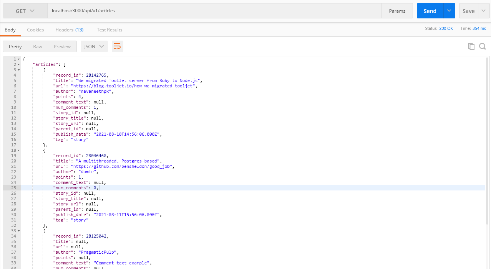
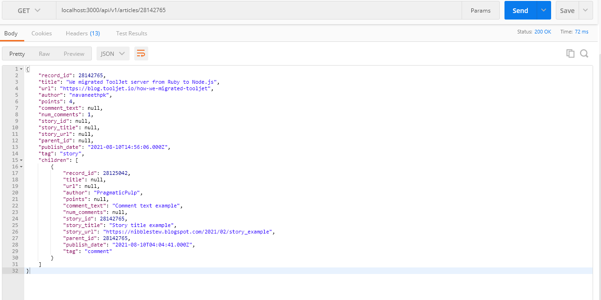
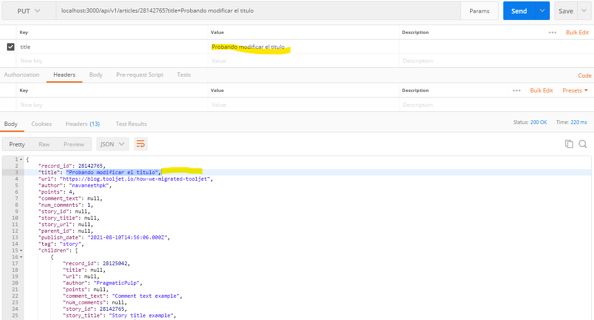
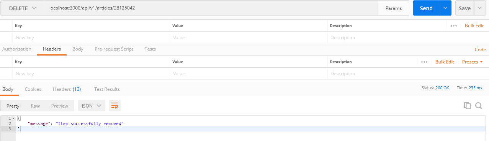

# README

This README would normally document whatever steps are necessary to get the
application up and running.

Things you may want to cover:

* Ruby version: 2.7.2

* System dependencies: Redis, Postgres, Sidekiq, HTTParty

# La API se desplego en heroku y se puede acceder mediante el siguiente enlace
https://thawing-crag-90830.herokuapp.com/api/v1/articles

# Para levantar la aplicacion con docker lo primero que se debe hacer es iniciar el docker-compose

`docker-compose up`

# Para visualizar la lista de articulos dirigirse al endpoint de articles

**GET** `localhost:3000/api/v1/articles`
* acepta los parametros: [search, date, page, per_page]
* search: Permite buscar en los titulos o story titulos el texto asignado
* date: Permite los filtrar los registros con la fecha asignada
* page y per_page: Sirven para la paginacion, per_page es el limite por pagina y page la pagina que deseamos ver

# Para visualizar un articulo en especifico

**GET** `localhost:3000/api/v1/articles/28142765`

# Para modificar un articulo en especifico

**PUT** `localhost:3000/api/v1/articles/28142765`
* acepta los parametros: [title, url, comment_text, story_title, story_url]

# Para visualizar un articulo en especifico

**DELETE** `localhost:3000/api/v1/articles/28142765`
* Elimina el registro

